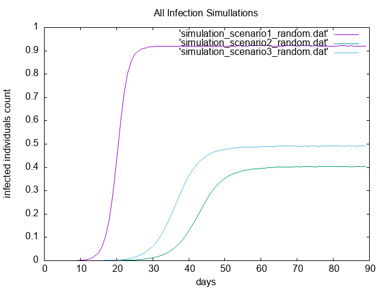

# Mesures de réseaux d'interaction

Nous allons analyser un réseau de collaboration scientifique en informatique. Le réseau est extrait de DBLP et disponible sur [SNAP](https://snap.stanford.edu/data/com-DBLP.html).

GraphStream permet de mesurer de nombreuses caractéristiques d'un réseau. La plupart de ces mesures sont implantées comme des méthodes statiques dans la classe [`Toolkit`](https://data.graphstream-project.org/api/gs-algo/current/org/graphstream/algorithm/Toolkit.html). Elles vous seront très utiles par la suite.

**Question n°1.** Commencez par télécharger les données et les lire avec GraphStream. GraphStream sait lire ce format. Voir [`FileSourceEdge`](https://data.graphstream-project.org/api/gs-core/current/org/graphstream/stream/file/FileSourceEdge.html) et ce [tutoriel](http://graphstream-project.org/doc/Tutorials/Reading-files-using-FileSource/). Vous pouvez essayer de visualiser le graphe mais pour cette taille ça sera très lent et très peu parlant.

    **DONE**

**Question n°2.** Prenez quelques mesures de base: nombre de nœuds et de liens, degré moyen, coefficient de clustering. Quel sera le coefficient de clustering pour un réseau aléatoire de la même taille et du même degré moyen ?

- NodeCount: 317080
- EdgeCount: 1049866
- averageDegree: 6.62208890914917
- averageClusteringCoefficient: 0.6324308280637396

Quel sera le coefficient de clustering pour un réseau aléatoire de la même taille et du même degré moyen ?

Étant donné que le coefficient de clustering Ci calcule la probabilité qu'un noeud i soit relié à un
autre.
Donc, dans un graph aléatoire, la probabilité est la même pour tout les noeuds du graph.

Du coup, le coefficient de clustering sera la moyenne des degrès sur le nombre des degrès.

- averageClusteringCoefficient in a similar  graph that is random: 2.0884599814397534E-5


**Question n°3.** Le réseau est-il connexe ? Un réseau aléatoire de la même taille et degré moyen sera-t-il connexe ? À partir de quel degré moyen un réseau aléatoire avec cette taille devient connexe ?

- Oui le graph est connexe.
- Un réseau aléatoire de la même taille et degré moyen est connexe ssi M/LogN > 1.
    * ou M = la moyenne des degrès des noeuds.
    * et N = le nombre de noeuds.

  Dans notre cas on a M = 6.62208890914917.

  et logN = log(317080) = 12,666909387.

  Donc M/logN = 0,522786475.
  
  Donc un réseau aléatoire de la même taille et degré moyen est non connexe.

- Pour qu'un graph aléatoire avec la même taille soit connexe, le degrès moyen M doit être strictement plus grand que 12,666909387


**Question n°4.** Calculez la distribution des degrés et tracez-la avec `gnuplot` (ou avec votre outil préféré) d'abord en échelle linéaire, ensuite en échelle log-log. Est-ce qu'on observe une ligne droite en log-log ? Que cela nous indique ? Tracez la distribution de Poisson avec la même moyenne pour comparaison. Utilisez la commande `fit` de `gnuplot` pour trouver les coefficients de la loi de puissance et tracez-la.

La distribution de degrés $`p_sk = \frac{N_k}{N}`$ est la probabilité qu'un nœud choisi au hasard ait degré $`k`$. On peut utiliser Toolkit.degreeDistribution() pour obtenir $`N_k`$ et normaliser par la suite :

```java
    int[] dd = Toolkit.degreeDistribution(graph);
    for (int k = 0; k < dd.length; k++) {
      if (dd[k] != 0) {
        System.out.printf(Locale.US, "%6d%20.8f%n", k, (double)dd[k] / graph.getNodeCount());
      }
    }
```

En traçant la distribution de degrés en échelle log-log on observe une ligne droite pendant plusieurs ordres de grandeur. Cela nous indique une loi de puissance :

```math
    p_k = C k^{-\gamma}
```

On utilise ce [script](./plot_dd.gnu) pour tracer la distribution et estimer l'exposant de la loi de puissance.


On a $`\gamma = 2.7 \pm 0.04`$

**Question n°5.** Maintenant on va calculer la distance moyenne dans le réseau. Le calcul des plus courts chemins entre toutes les paires de nœuds prendra plusieurs heures pour cette taille de réseau. C'est pourquoi on va estimer la distance moyenne par échantillonnage en faisant un parcours en largeur à partir de 1000 sommets choisis au hasard. L'hypothèse des six degrés de séparation se confirme-t-elle ? Est-ce qu'il s'agit d'un réseau petit monde ? Quelle sera la distance moyenne dans un réseau aléatoire avec les mêmes caractéristiques ? Tracez également la *distribution* des distances. Formulez une hypothèse sur la loi de cette distribution.

- Avec notre échantillonnage on a une distance moyenne de 6.796943058534124.
- Donc, l'hypothèse des six degrés de séparation se confirme.
- Pour que le réseau soit un réseau type petit monde, on doit avoir: 
    
  * davg ~=  lnN/lnM ou davg est la distance moyenne.
  * et N est le nombre de noeuds.
  * et M est le degres moyen.
  
  Dans notre cas on a lnN/lnM = 6,700611819.
  et davg = 6.796943058534124.

  Donc, notre réseau est bien un réseau type petit monde.
  
- La distance moyenne dans un réseau aléatoire avec les mêmes caractéristiques sera: davg ~=  lnN/lnM ~= 6,700611819.

- Voiçi la distribution des distances:

     
  
  On a utilisé le script gnuplot ci dessous:
  
  ```gnuplot

	set terminal png
	set title "Distance distribution"
	set xlabel 'd'
	set ylabel 'p(d)'
	set output 'distancesDistrobution.png'

	plot 'distancesHistogram.dat' with lines title 'distances histogram to distance distribution'
  
  ```
  Avec les données de notre histogram de distances (en les affichant avec printf):
  
  ```txt
     0          0.00000315
     1          0.00002065
     2          0.00024990
     3          0.00305799
     4          0.02763719
     5          0.12952498
     6          0.27414201
     7          0.28143229
     8          0.17183861
     9          0.07540130
    10          0.02603512
    11          0.00774125
    12          0.00213479
    13          0.00057485
    14          0.00015460
    15          0.00004027
    16          0.00000909
    17          0.00000173
    18          0.00000022
    19          0.00000003
    20          0.00000000
    21          0.00000000
  
  ```
  
- On voit que la distribution des distances est en forme de cloche. On peut supposer que la loi derrière est une de poisson/binomiale.
	
	
**Question n°6.** Utilisez les générateurs de GraphStream pour générer un réseau aléatoire et un réseau avec la méthode d'attachement préférentiel (Barabasi-Albert) qui ont la même taille et le même degré moyen. Refaites les mesures des questions précédentes pour ces deux réseaux. Les résultats expérimentaux correspondent-ils aux prédictions théoriques ? Comparez avec le réseau de collaboration. Que peut-on conclure ?


***Graph aléa:***

- NodeCount: 317090
- EdgeCount: 1108857
- averageDegree: 6.99395751953125
- averageClusteringCoefficient: 2.5155159000996033E-5
- avgDistance: 6.728634727946078
 

- Voiçi la distribution des degrés: 
    
    
    
    --- 

- Voiçi la distribution des distances: 
    
    
    
    
   
***Graph préférentiel:***
    
- NodeCount: 317084
- EdgeCount: 1269742
- averageDegree: 8.008868217468262
- averageClusteringCoefficient: 4.300926930010513E-4
- avgDistance: 4.877203611661264    
    
 

- Voiçi la distribution des degrés: 
    
    
    
    --- 

- Voiçi la distribution des distances: 
    
    
    
    


***Aggrégation des distributions:***    


 

---

 
    
    

---


# Propagation dans des réseaux


**Question n°1.** 

- la probabilité de contaminer un collaborateur est de 1/7 ( un mail par semaine ).

- L'anti-virus est mis-à-jour 2/30 (deux fois par mois), ce qui donne 1/15. Donc, le taux de propagation est (1/7)/(1/15) = 2,142857143.

- le seuil épidémique du réseau est : lambdaC =  < k > / < k*k > = 0.045984725428484516

**Comparaison avec le seuil théorique d'un réseau aléatoire du même degré moyen:**

- Le seuil épidémique d'un réseau aléatoire au même degré moyen serait lambdaC = 1/(< k >+1) = 0,13119763. Il y a une différence car le degré de clustering est aussi différent. ( la formation des HUBs diffère dans les deux réseaux).


**Question n°2.** Simulation de la propagation du virus jour par jour pendant trois mois avec les scénarios données.

 

On peut conclure que l'immunisation fonctionne. De plus, l'immunisation séléctive est bien meilleure !

**Question n°3.** le degré moyen des groupes 0 et 1:

* averageDegree(group0): 6.561000378453387
* averageDegree(group1): 18.45390437744418

**Explication de la différence:**

Groupe0 represente 50% de notre population (ces 50% sont choisis aléatroirement).
Chaque noeud du groupe1 est un noeud qui est accessible par un autre noeud du groupe 0.

Donc, il y a forcemment moins de noeuds dans le groupe 1. Car, suivant notre construction des groupes, on peut avoir deux noeuds (ou plus) du groupe 0 qui visent le même noeuds dans le groupe 1.

Autrement dit, il y a plus de HUBs que de noeuds normaux dans le groupe 1, ce qui justifie le fait que le degrès moyen est plus grand.


**Question n°4.** Le seuil épidémique du réseau modifié pour chacune des stratégies d'immunisation:

pour la simulation du scénario: 
* n°2: 0.04686494599556906
* n°3: 0.0935182683358852 

Le seuil épidémique du scénario 2 est approximativement égal à celui du réseau initial.
Le seuil épidémique du scénario 3 est plus grand car c'est une immunisation séléctive, ce qui nous a permi de supprimer beaucoup de HUBs dans le réseau.


**Question n°5.** Refaire les simulations avec le modèle aléatoire et d'attachement préférentiel de la même taille et le même degré moyen.


***modèle aléatoire:***

 

---

***modèle d'attachement préférentiel:***

 


---


**Courbes supplimentaires:**


***Scenario/Simulation 1 dans toutes les configurations***

 

---


***Scenario/Simulation 2 dans toutes les configurations***


 


---


***Scenario/Simulation 3 dans toutes les configurations***

 

---


   
